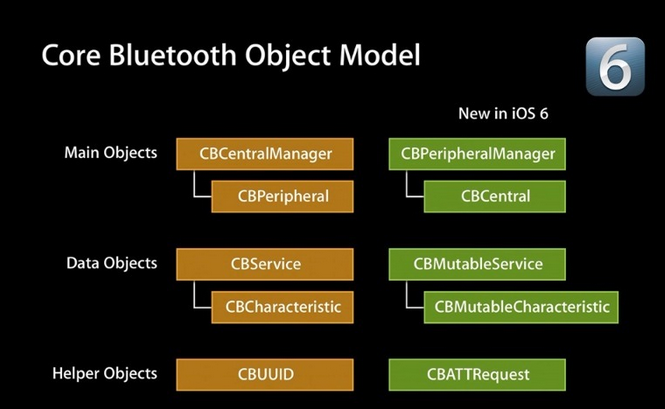

# baseK(相关基础知识)

### 蓝牙常见名称和缩写


- BLE:(Bluetooth low energy)蓝牙4.0设备因为低耗电,也叫BLE
- peripheral,central:外设和中心设备,发起链接的是central(一般是指手机),被链接的设备是peripheral(运动手环)
- service and characteristic:(服务和特征)每个设备会提供服务和特征,类似于服务端的API,但是结构不同.`每个设备会有很多服务`,每个服务中包含`很多字段`,这些字段的权限一般分为读(read),写(write),通知(notify)几种,就是我们连接设备后具体需要操作的内容
- Description:每个characteristic可以对应一个或者多个Description用于描述characteristic的信息或属性(eg.范围,计量单位)

### 蓝牙基础知识

- CoreBluetooth框架的核心其实是俩东西:peripheral和central,对应他们分别有一组相关的API和类


- 这两组api粉笔对应不同的业务常见:左侧叫中心模式,就是以你的app作为中心,连接其他的外设的场景;而右侧称为外设模式,使用`手机作为外设`连接其他中心设备操作的场景

- 服务和特征(service and characteristic)
    * 每个设备都会有1个or多个服务
    * 每个服务里都会有1个or多个特征
    * 特征就是具体键值对,提供数据的地方
    * 每个特征属性分为:读,写,通知等等

```objc
typedef NS_OPTIONS(NSUInteger, CBCharacteristicProperties) {
	CBCharacteristicPropertyBroadcast												= 0x01,
	CBCharacteristicPropertyRead													= 0x02,
	CBCharacteristicPropertyWriteWithoutResponse									= 0x04,
	CBCharacteristicPropertyWrite													= 0x08,
	CBCharacteristicPropertyNotify													= 0x10,
	CBCharacteristicPropertyIndicate												= 0x20,
	CBCharacteristicPropertyAuthenticatedSignedWrites								= 0x40,
	CBCharacteristicPropertyExtendedProperties										= 0x80,
	CBCharacteristicPropertyNotifyEncryptionRequired NS_ENUM_AVAILABLE(NA, 6_0)		= 0x100,
	CBCharacteristicPropertyIndicateEncryptionRequired NS_ENUM_AVAILABLE(NA, 6_0)	= 0x200
};
```

- 外设,服务,特征的关系
 

## BLE中心模式流程
- 1.建立中心角色
- 2.扫描外设(Discover Peripheral)
- 3.连接外设(Connect Peripheral)
- 4.扫描外设中的服务和特征(Discover Services And Characteristics)
    * 4.1 获取外设的services
    * 4.2 获取外设的Characteristics,获取characteristics的值,,获取Characteristics的Descriptor和Descriptor的值
- 5.利用特征与外设做数据交互(Explore And Interact)
- 6.订阅Characteristic的通知
- 7.断开连接(Disconnect)

## BLE外设模式流程
- 1.启动一个Peripheral管理对象
- 2.本地peripheral设置服务,特征,描述,权限等等
- 3.peripheral发送广告
- 4.设置处理订阅,取消订阅,读characteristic,写characteristic的代理方法

## 蓝牙设备的状态
- 1.待机状态(standby):设备没有传输和发送数据,并且没有连接到任何外设
- 2.广播状态(Advertiser):周期性广播状态
- 3.扫描状态(Scanner):主动搜索正在广播的设备
- 4.发起链接状态(Initiator):主动向扫描设备发起连接
- 5.主设备(Master):作为主设备连接到其它设备.
- 6.从设备(Slave):作为从设备链接到其它设备

## 蓝牙设备的五种工作状态

- 准备(Standby)
- 广播(Advertising)
- 监听扫描(Scanning)
- 发起连接(Initiating)
- 已连接(Connected)

## 蓝牙和版本使用限制
- 蓝牙2.0:越狱设备
- BLE:iOS6以上
- MFI认证设备:无限制

## BLE测试
- 两台BLE设备
- 如何让iOS模拟器也能测试BLE?
    * 买一个CSR蓝牙4.0 USB适配器,插在Mac上
    * 在终端输入sudo nvram bluetoothHostControllerSwitchBehavior="never"
    * 重启Mac
    * 用Xcode4.6调试代码,将程序跑在iOS6.1模拟器上
    * 苹果把iOS7.0模拟器对BLE的支持移除了
