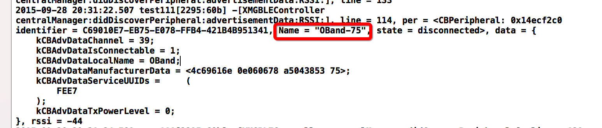

# BLE中心模式流程-coding
## BLE中心模式流程
- 1.建立中心角色
- 2.扫描外设(Discover Peripheral)
- 3.连接外设(Connect Peripheral)
- 4.扫描外设中的服务和特征(Discover Services And Characteristics)
    * 4.1 获取外设的services
    * 4.2 获取外设的Characteristics,获取characteristics的值,,获取Characteristics的Descriptor和Descriptor的值
- 5.利用特征与外设做数据交互(Explore And Interact)
- 6.订阅Characteristic的通知
- 7.断开连接(Disconnect)

## 准备环境

- 1.Xcode7.0
- 2.手机
- 3.外设(手机+LightBlue)

## 实现步骤
#### 1.导入CB头文件,建立主设备管理类,设置主设备代理

```objc
#import <CoreBluetooth/CoreBluetooth.h>
@interface XMGBLEController () <CBCentralManagerDelegate>
@property (nonatomic, strong) CBCentralManager *cMgr; /**< 中心管理设备 */
@end
@implementation XMGBLEController
#pragma mark - 懒加载
// 1.建立中心管理者
- (CBCentralManager *)cMgr
{
    if (!_cMgr) {
        NSLog(@"%s, line = %d", __FUNCTION__, __LINE__);
        /*
         设置主设备的代理,CBCentralManagerDelegate
         必须实现的：
         - (void)centralManagerDidUpdateState:(CBCentralManager *)central;//主设备状态改变调用，在初始化CBCentralManager的适合会打开设备，只有当设备正确打开后才能使用
         其他选择实现的委托中比较重要的：
         - (void)centralManager:(CBCentralManager *)central didDiscoverPeripheral:(CBPeripheral *)peripheral advertisementData:(NSDictionary *)advertisementData RSSI:(NSNumber *)RSSI; //找到外设
         - (void)centralManager:(CBCentralManager *)central didConnectPeripheral:(CBPeripheral *)peripheral;//连接外设成功
         - (void)centralManager:(CBCentralManager *)central didFailToConnectPeripheral:(CBPeripheral *)peripheral error:(NSError *)error;//外设连接失败
         - (void)centralManager:(CBCentralManager *)central didDisconnectPeripheral:(CBPeripheral *)peripheral error:(NSError *)error;//断开外设
         */
        _cMgr = [[CBCentralManager alloc] initWithDelegate:self queue:dispatch_get_main_queue()]; // 线程不传默认是主线程
    }
    return _cMgr;
}
- (void)viewDidLoad {
    [super viewDidLoad];
    self.title = @"BLE";
    self.view.backgroundColor = [UIColor orangeColor];
    // 初始化
    [self cMgr];
    // 不能在此处扫描,因为状态还没变为打开
    //[self.cMgr scanForPeripheralsWithServices:nil options:nil];
}
```
#### 2.扫描外设

- 扫描的方法防治cMgr成功打开的代理方法中
- 只有设备成功打开,才能开始扫描,否则会报错

```objc
#pragma mark - CBCentralManagerDelegate
// 中心管理者状态改变, 在初始化CBCentralManager的时候会打开设备，只有当设备正确打开后才能使用
- (void)centralManagerDidUpdateState:(CBCentralManager *)central
{
    NSLog(@"%s, line = %d", __FUNCTION__, __LINE__);
    switch (central.state) {
        case CBCentralManagerStateUnknown:
            NSLog(@">>>CBCentralManagerStateUnknown");
            break;
        case CBCentralManagerStateResetting:
            NSLog(@">>>CBCentralManagerStateResetting");
            break;
        case CBCentralManagerStateUnsupported:
            NSLog(@">>>CBCentralManagerStateUnsupported");
            break;
        case CBCentralManagerStateUnauthorized:
            NSLog(@">>>CBCentralManagerStateUnauthorized");
            break;
        case CBCentralManagerStatePoweredOff:
            NSLog(@">>>CBCentralManagerStatePoweredOff");
            break;
        case CBCentralManagerStatePoweredOn:
            NSLog(@">>>CBCentralManagerStatePoweredOn");
            // 2.开始扫描周围的外设
            /*
             第一个参数nil就是扫描周围所有的外设，扫描到外设后会进入
             - (void)centralManager:(CBCentralManager *)central didDiscoverPeripheral:(CBPeripheral *)peripheral advertisementData:(NSDictionary *)advertisementData RSSI:(NSNumber *)RSSI;
             */
            [self.cMgr scanForPeripheralsWithServices:nil options:nil];

            break;
        default:
        break;
    }
}
// 扫描到设备会进入到此代理方法
- (void)centralManager:(CBCentralManager *)central didDiscoverPeripheral:(CBPeripheral *)peripheral advertisementData:(NSDictionary<NSString *,id> *)advertisementData RSSI:(NSNumber *)RSSI
{
    NSLog(@"%s, line = %d, per = %@, data = %@, rssi = %@", __FUNCTION__, __LINE__, peripheral, advertisementData, RSSI);
    // 接下来连接设备
}

```


#### 3.连接外设
- 扫描手环,打印结果

- 根据打印结果

```objc
// 扫描到设备会进入到此代理方法
- (void)centralManager:(CBCentralManager *)central didDiscoverPeripheral:(CBPeripheral *)peripheral advertisementData:(NSDictionary<NSString *,id> *)advertisementData RSSI:(NSNumber *)RSSI
{
    NSLog(@"%s, line = %d, per = %@, data = %@, rssi = %@", __FUNCTION__, __LINE__, peripheral, advertisementData, RSSI);

    // 3.接下来可以连接设备
    //如果你没有设备，可以下载一个app叫lightbule的app去模拟一个设备
    //这里自己去设置下连接规则，我设置的是二维码扫描到的运动手环的设备号
    // 判断设备号是否扫描到
    if ([peripheral.name isEqualToString:@"OBand-75"]) {
        /*
         一个主设备最多能连7个外设，每个外设最多只能给一个主设备连接,连接成功，失败，断开会进入各自的委托
         - (void)centralManager:(CBCentralManager *)central didConnectPeripheral:(CBPeripheral *)peripheral;//连接外设成功的委托
         - (void)centralManager:(CBCentralManager *)central didFailToConnectPeripheral:(CBPeripheral *)peripheral error:(NSError *)error;//外设连接失败的委托
         - (void)centralManager:(CBCentralManager *)central didDisconnectPeripheral:(CBPeripheral *)peripheral error:(NSError *)error;//断开外设的委托
         */
        // 保存外设,否则方法结束就销毁
        self.per = peripheral;
        [self.cMgr connectPeripheral:self.per options:nil];
    }else
    {
        // 此处Alert提示未扫描到设备,重新扫描
#warning noCode
        NSLog(@"没扫描到 >>>>>>>>  %s, line = %d", __FUNCTION__, __LINE__);
    }
}
// 外设连接成功
- (void)centralManager:(CBCentralManager *)central didConnectPeripheral:(CBPeripheral *)peripheral
{
    NSLog(@"%s, line = %d", __FUNCTION__, __LINE__);
    NSLog(@">>>连接到名称为（%@）的设备-成功",peripheral.name);
}
// 外设连接失败
- (void)centralManager:(CBCentralManager *)central didFailToConnectPeripheral:(CBPeripheral *)peripheral error:(NSError *)error
{
    NSLog(@"%s, line = %d", __FUNCTION__, __LINE__);
}
// 断开连接(丢失连接)
- (void)centralManager:(CBCentralManager *)central didDisconnectPeripheral:(CBPeripheral *)peripheral error:(NSError *)error
{
    NSLog(@"%s, line = %d", __FUNCTION__, __LINE__);
}
```

#### 4.扫描外设中的服务和特征

```objc
  设备链接成功后,就可以扫描设备的服务(services)了,同样是通过代理,扫描到结果后会触发某代理方法.
  注意:此时CBCentralManagerDelegate已经不能满足需求,需要新的CBPeripheralDelegate来搞定.
  该协议中包含了central与peripheral的许多回调方法
  (eg.:获取services,获取characteristics,获取characteristics的值,获取characteristics的Descriptor以及Descriptor的值,写数据,读RSSI,用通知的方式订阅数据等等).

```
- 4.1 获取外设的services
    * 首先设置外设的代理,并搜寻services
    * 然后在代理方法`peripheral:didDiscoverServices:`中遍历services

```objc
// 外设连接成功
- (void)centralManager:(CBCentralManager *)central didConnectPeripheral:(CBPeripheral *)peripheral
{
    NSLog(@"%s, line = %d", __FUNCTION__, __LINE__);
    NSLog(@">>>连接到名称为（%@）的设备-成功",peripheral.name);
    //设置的peripheral代理CBPeripheralDelegate
    //@interface ViewController : UIViewController<CBCentralManagerDelegate,CBPeripheralDelegate>
    [peripheral setDelegate:self];

    //扫描外设Services，成功后会进入方法：-(void)peripheral:(CBPeripheral *)peripheral didDiscoverServices:(NSError *)error{
    [peripheral discoverServices:nil];
    /*
     Discovers the specified services of the peripheral.
     An array of CBUUID objects that you are interested in. Here, each CBUUID object represents a UUID that identifies the type of service you want to discover.
     */
}

#pragma mark - CBPeripheralDelegate
// 发现外设的service
- (void)peripheral:(CBPeripheral *)peripheral didDiscoverServices:(NSError *)error
{
    if (error)
    {
        NSLog(@">>>Discovered services for %@ with error: %@", peripheral.name, [error localizedDescription]);
        return;
    }

    for (CBService *service in peripheral.services) {
        NSLog(@"service.UUID = %@", service.UUID);
        //扫描每个service的Characteristics，扫描到后会进入方法： -(void)peripheral:(CBPeripheral *)peripheral didDiscoverCharacteristicsForService:(CBService *)service error:(NSError *)error
        [peripheral discoverCharacteristics:nil forService:service];
    }
}
```
- 4.2 获取外设的characteris,获取Characteristics的值,获取Characteristics的Descriptor以及Descriptor的值

```objc
// 外设发现service的特征
- (void)peripheral:(CBPeripheral *)peripheral didDiscoverCharacteristicsForService:(CBService *)service error:(NSError *)error
{
    if (error)
    {
        NSLog(@"error Discovered characteristics for %@ with error: %@", service.UUID, [error localizedDescription]);
        return;
    }
    for (CBCharacteristic *characteristic in service.characteristics)
    {
        NSLog(@"service:%@ 的 Characteristic: %@",service.UUID,characteristic.UUID);
    }

#warning noCodeFor 优化,分开写是为了让大家看注释清晰,并不符合编码规范
    //获取Characteristic的值，读到数据会进入方法：-(void)peripheral:(CBPeripheral *)peripheral didUpdateValueForCharacteristic:(CBCharacteristic *)characteristic error:(NSError *)error
    for (CBCharacteristic *characteristic in service.characteristics){
        [peripheral readValueForCharacteristic:characteristic]; // 外设读取特征的值
    }

    //搜索Characteristic的Descriptors，读到数据会进入方法：-(void)peripheral:(CBPeripheral *)peripheral didDiscoverDescriptorsForCharacteristic:(CBCharacteristic *)characteristic error:(NSError *)error
    for (CBCharacteristic *characteristic in service.characteristics){
        [peripheral discoverDescriptorsForCharacteristic:characteristic]; // 外设发现特征的描述
    }
}

// 获取characteristic的值
- (void)peripheral:(CBPeripheral *)peripheral didUpdateValueForCharacteristic:(nonnull CBCharacteristic *)characteristic error:(nullable NSError *)error
{
    //打印出characteristic的UUID和值
    //!注意，value的类型是NSData，具体开发时，会根据外设协议制定的方式去解析数据
    NSLog(@"%s, line = %d, characteristic.UUID:%@  value:%@", __FUNCTION__, __LINE__, characteristic.UUID, characteristic.value);
}
// 获取Characteristics的 descriptor的值
- (void)peripheral:(CBPeripheral *)peripheral didUpdateValueForDescriptor:(nonnull CBDescriptor *)descriptor error:(nullable NSError *)error
{
    //打印出DescriptorsUUID 和value
    //这个descriptor都是对于characteristic的描述，一般都是字符串，所以这里我们转换成字符串去解析
    NSLog(@"%s, line = %d, descriptor.UUID:%@ value:%@", __FUNCTION__, __LINE__, descriptor.UUID, descriptor.value);
}
// 发现特征Characteristics的描述Descriptor
- (void)peripheral:(CBPeripheral *)peripheral didDiscoverDescriptorsForCharacteristic:(nonnull CBCharacteristic *)characteristic error:(nullable NSError *)error
{
    NSLog(@"%s, line = %d", __FUNCTION__, __LINE__);
    for (CBDescriptor *descriptor in characteristic.descriptors) {
        NSLog(@"descriptor.UUID:%@",descriptor.UUID);
    }
}
```

#### 5.写数据到特征中

```objc
// 5.将数据写入特征(自定义方法,为了看的更清楚,没别的意思)
- (void)yf_peripheral:(CBPeripheral *)peripheral writeData:(NSData *)data forCharacteristic:(CBCharacteristic *)characteristic
{
    /*
    typedef NS_OPTIONS(NSUInteger, CBCharacteristicProperties) {
        CBCharacteristicPropertyBroadcast												= 0x01,
        CBCharacteristicPropertyRead													= 0x02,
        CBCharacteristicPropertyWriteWithoutResponse									= 0x04,
        CBCharacteristicPropertyWrite													= 0x08,
        CBCharacteristicPropertyNotify													= 0x10,
        CBCharacteristicPropertyIndicate												= 0x20,
        CBCharacteristicPropertyAuthenticatedSignedWrites								= 0x40,
        CBCharacteristicPropertyExtendedProperties										= 0x80,
        CBCharacteristicPropertyNotifyEncryptionRequired NS_ENUM_AVAILABLE(NA, 6_0)		= 0x100,
        CBCharacteristicPropertyIndicateEncryptionRequired NS_ENUM_AVAILABLE(NA, 6_0)	= 0x200
    };
     打印出特征的权限(characteristic.properties),可以看到有很多种,这是一个NS_OPTIONS的枚举,可以是多个值
     常见的又read,write,noitfy,indicate.知道这几个基本够用了,前俩是读写权限,后俩都是通知,俩不同的通知方式
     */
    NSLog(@"%s, line = %d, characteristic.properties:%d", __FUNCTION__, __LINE__, characteristic.properties);

    // 只有特征的properties中有写的属性时候,才写
    if (characteristic.properties & CBCharacteristicPropertyWrite) {
        // 这句才是正宗的核心代码
        [peripheral writeValue:data forCharacteristic:characteristic type:CBCharacteristicWriteWithResponse];
    }
}
```
#### 6.订阅特征的通知

```objc
// 设置通知
- (void)yf_peripheral:(CBPeripheral *)peripheral setNotifyForCharacteristic:(CBCharacteristic *)characteristic
{
    // 设置通知, 数据会进入 peripheral:didUpdateValueForCharacteristic:error:方法
    [peripheral setNotifyValue:YES forCharacteristic:characteristic];
}
// 取消通知
- (void)yf_peripheral:(CBPeripheral *)peripheral cancelNotifyForCharacteristic:(CBCharacteristic *)characteristic
{
    [peripheral setNotifyValue:NO forCharacteristic:characteristic];
}
```

#### 7.断开连接

```objc
// 7.断开连接
- (void)yf_cMgr:(CBCentralManager *)cMgr stopScanAndDisConnectWithPeripheral:(CBPeripheral *)peripheral
{
    // 停止扫描
    [cMgr stopScan];
    // 断开连接
    [cMgr cancelPeripheralConnection:peripheral];
}
```
