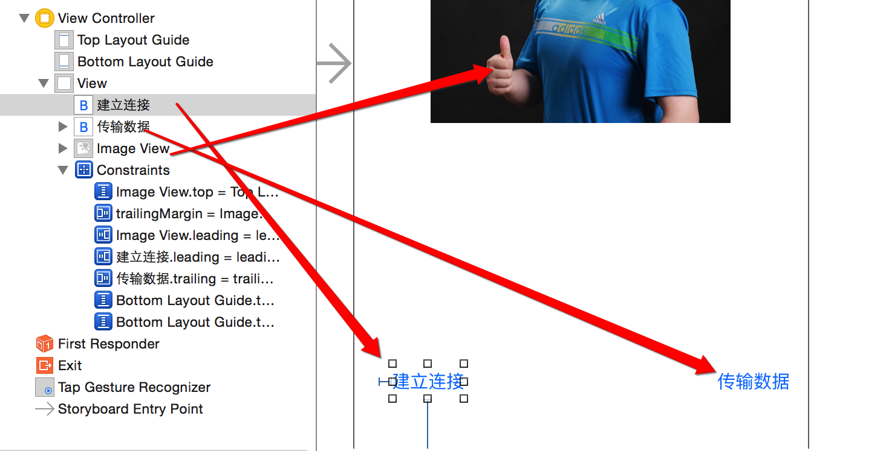
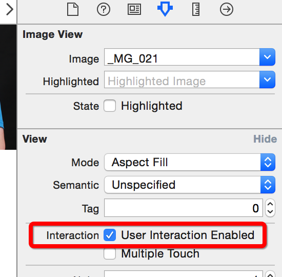
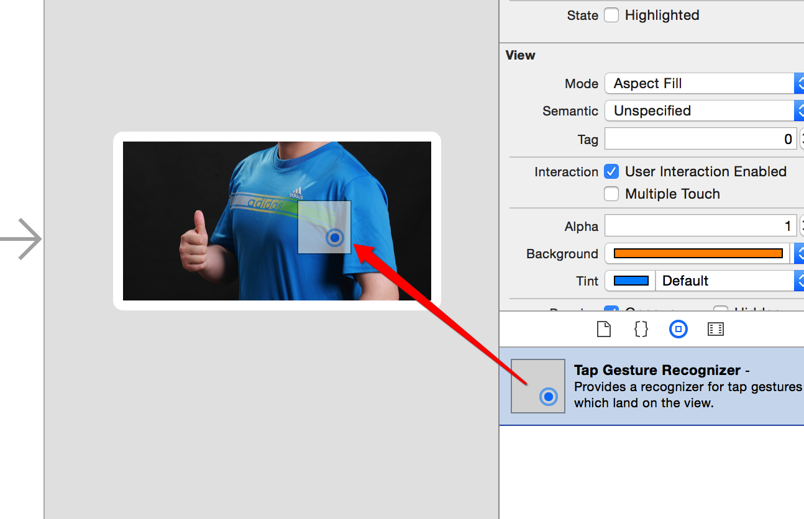

# GameKit用法

## 一.准备工作
- 1.搭建UI


- 2.拖线

```objc
// 图片
@property (weak, nonatomic) IBOutlet UIImageView *imageView;

// 建立连接
- (IBAction)buildConnect:(id)sender{}

// 发送数据
- (IBAction)sendData:(id)sender{}
```
## 二.连接蓝牙

- 显示可以连接的蓝牙设备列表

```objc
- (IBAction)buildConnect:(id)sender {
    // 创建弹窗
    GKPeerPickerController *ppc = [[GKPeerPickerController alloc] init];
    // 设置代理  @interface ViewController () <GKPeerPickerControllerDelegate>
    ppc.delegate = self;
    // 展示
    [ppc show];
}
```
- 监听蓝牙的连接

```objc
#pragma mark -GKPeerPickerControllerDelegate
// 连接成功就会调用
- (void)peerPickerController:(GKPeerPickerController *)picker // 弹窗
              didConnectPeer:(NSString *)peerID // 连接到的蓝牙设备号
                   toSession:(GKSession *)session // 连接会话(通过它进行数据交互)
{
    NSLog(@"%s, line = %d", __FUNCTION__, __LINE__);
    // 弹窗消失
    [picker dismiss];
}
```

## 三.利用蓝牙传输数据

- 点击图片从相册中选择一张显示本机
    * 可以修改imaV为Btn,也可以为imaV添加手势
        * 1.修改imageView的用户交互
    
        * 2.添加手势到图片上
    
        * 3.拖出手势的响应事件
    
        * 4.完善相册选择图片代码

```objc
    // 手势-点击从相册中选一张照片
- (IBAction)tapImage:(UITapGestureRecognizer *)sender {
    NSLog(@"%s, line = %d", __FUNCTION__, __LINE__);
    // 先判断是否有相册
    if (![UIImagePickerController isSourceTypeAvailable:UIImagePickerControllerSourceTypePhotoLibrary]) {
        return;
    }
    // 创建弹出的控制器
    UIImagePickerController *ipc = [[UIImagePickerController alloc] init];
    // 设置图片来源为相册
    ipc.sourceType = UIImagePickerControllerSourceTypePhotoLibrary;
    // 设置代理 @interface ViewController () <UINavigationControllerDelegate, UIImagePickerControllerDelegate>
    ipc.delegate = self;
    // modal出来
    [self presentViewController:ipc animated:YES completion:nil];
}
#pragma mark - UINavigationControllerDelegate, UIImagePickerControllerDelegate
// 选中某图片后调用
- (void)imagePickerController:(UIImagePickerController *)picker didFinishPickingMediaWithInfo:(NSDictionary<NSString *,id> *)info
{
    // 控制器返回
    [picker dismissViewControllerAnimated:YES completion:nil];
    // 设置图片
    self.imageView.image = info[UIImagePickerControllerOriginalImage];
}
```

- 点击发送数据完成图片显示到另一个蓝牙机器上
    * 1.分析需要通过GKSession对象来传递数据,所以在`peerPickerController:didConnectPeer:didConnectPeer:`的方法中保存session会话

```objc
@property (nonatomic, strong) GKSession *session; /**< 蓝牙连接会话 */

// 连接成功就会调用
- (void)peerPickerController:(GKPeerPickerController *)picker // 弹窗
              didConnectPeer:(NSString *)peerID // 连接到的蓝牙设备号
                   toSession:(GKSession *)session // 连接会话(通过它进行数据交互)
{
    NSLog(@"%s, line = %d", __FUNCTION__, __LINE__);
    // 弹窗消失
    [picker dismiss];
    // 保存会话
    self.session = session;
}
```
- 发送

```objc
// 发送数据
- (IBAction)sendData:(id)sender {
    if (self.imageView.image == nil) return; // 有图片才继续执行
    // 通过蓝牙链接会话发送数据到所有设备
    [self.session sendDataToAllPeers:UIImagePNGRepresentation(self.imageView.image) // 数据
                        withDataMode:GKSendDataReliable // 枚举:发完为止
                               error:nil];

}
```

- 接收

```objc
// 连接成功就会调用
- (void)peerPickerController:(GKPeerPickerController *)picker // 弹窗
              didConnectPeer:(NSString *)peerID // 连接到的蓝牙设备号
                   toSession:(GKSession *)session // 连接会话(通过它进行数据交互)
{
    NSLog(@"%s, line = %d", __FUNCTION__, __LINE__);
    // 弹窗消失
    [picker dismiss];
    // 保存会话
    self.session = session;
    // 处理接收到的数据[蓝牙设备接收到数据时,就会调用 [self receiveData:fromPeer:inSession:context:]]
    // 设置数据接受者为:self
    [self.session setDataReceiveHandler:self
                       withContext:nil];
}
#pragma mark - 蓝牙设备接收到数据时,就会调用
- (void)receiveData:(NSData *)data // 数据
           fromPeer:(NSString *)peer // 来自哪个设备
          inSession:(GKSession *)session // 连接会话
            context:(void *)context
{
    NSLog(@"%s, line = %d", __FUNCTION__, __LINE__);
    // 显示
    self.imageView.image = [UIImage imageWithData:data];
    // 写入相册
    UIImageWriteToSavedPhotosAlbum(self.imageView.image, nil, nil, nil);
}


```

## 四.注意

- 只能用于iOS设备之间的链接
- 只能用于同一个应用程序之间的连接
- 最好别利用蓝牙发送比较大的数据
